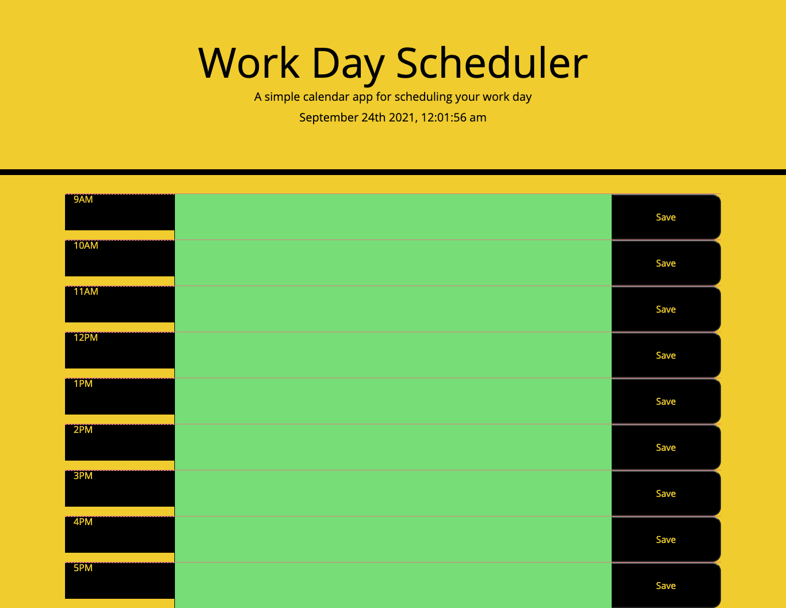

# Day-Planner

Site can be accessed here: https://konnenhannaford.github.io/Day-Planner/
The source can be retrieved by cloning and pulling from https://github.com/konnenhannaford/Day-Planner

# About
This page is a Daily Planner that allows the user to input information to schedule an upcoming day

# Tools used
HTML, CSS, Javascript, J-Query

# Updates
* Site has been developed to include an hourly schedule for an upcoming day
* Site has been developed to allow users to input information into daily slots
* Site has been developed to allow information to be saved if the page is refreshed
* Site has been developed to inlcude a moment tag to show currrent date and time
* Site has been developed to coour time slots by determining which fall into the past, present and future  
* Coding for site has been streamlined for efficiency
* A repo following best practice has been created
* A ReadMe detailing the site and its workings has been created
* Site has been deployed as a live site and applications loads with no errors

# Making Changes
Repo is public and can be updated by all via https://github.com/konnenhannaford/Java-Quizz

# Learnings and changes
Completing this has increased familiarity with the process of J-Query and its applications to a website.  It is very complex area that will require further investigation as it is essential to a large are of roles and tasks.  

# Contact Me
Email: konnen23@gmaill.com
Linkedin: https://au.linkedin.com/in/konnen-hannaford-b024994a
Github: https://github.com/konnenhannaford

# Licence
Copyright <2021> <Day-Planner>

Permission is hereby granted, free of charge, to any person obtaining a copy of this software and associated documentation files (the "Software"), to deal in the Software without restriction, including without limitation the rights to use, copy, modify, merge, publish, distribute, sublicense, and/or sell copies of the Software, and to permit persons to whom the Software is furnished to do so, subject to the following conditions:

The above copyright notice and this permission notice shall be included in all copies or substantial portions of the Software.

THE SOFTWARE IS PROVIDED "AS IS", WITHOUT WARRANTY OF ANY KIND, EXPRESS OR IMPLIED, INCLUDING BUT NOT LIMITED TO THE WARRANTIES OF MERCHANTABILITY, FITNESS FOR A PARTICULAR PURPOSE AND NONINFRINGEMENT. IN NO EVENT SHALL THE AUTHORS OR COPYRIGHT HOLDERS BE LIABLE FOR ANY CLAIM, DAMAGES OR OTHER LIABILITY, WHETHER IN AN ACTION OF CONTRACT, TORT OR OTHERWISE, ARISING FROM, OUT OF OR IN CONNECTION WITH THE SOFTWARE OR THE USE OR OTHER DEALINGS IN THE SOFTWARE.
  
  
# Site Screenshot

